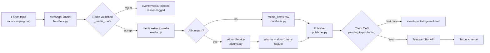
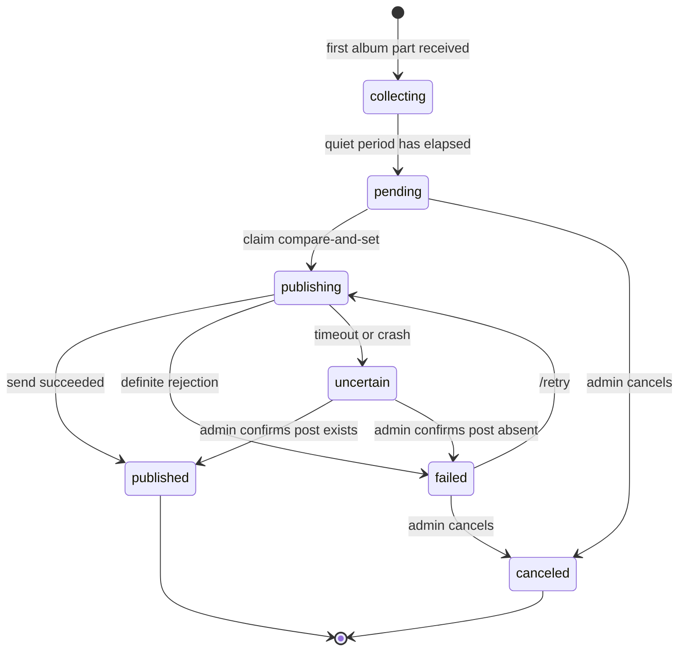
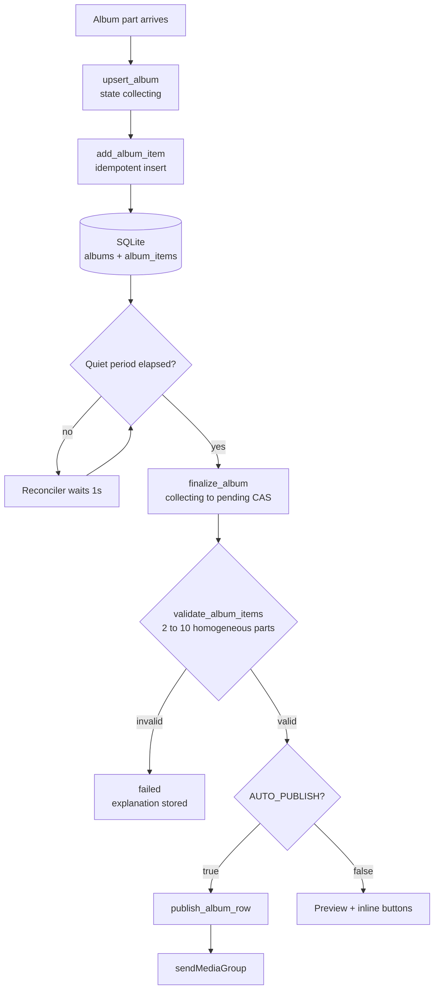
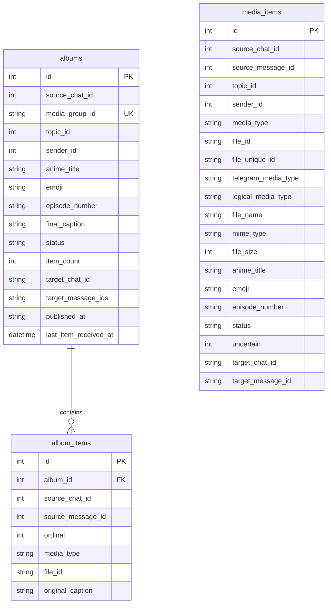
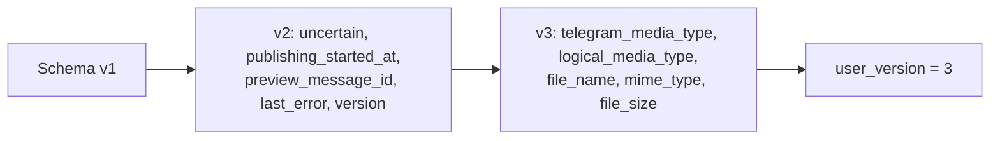
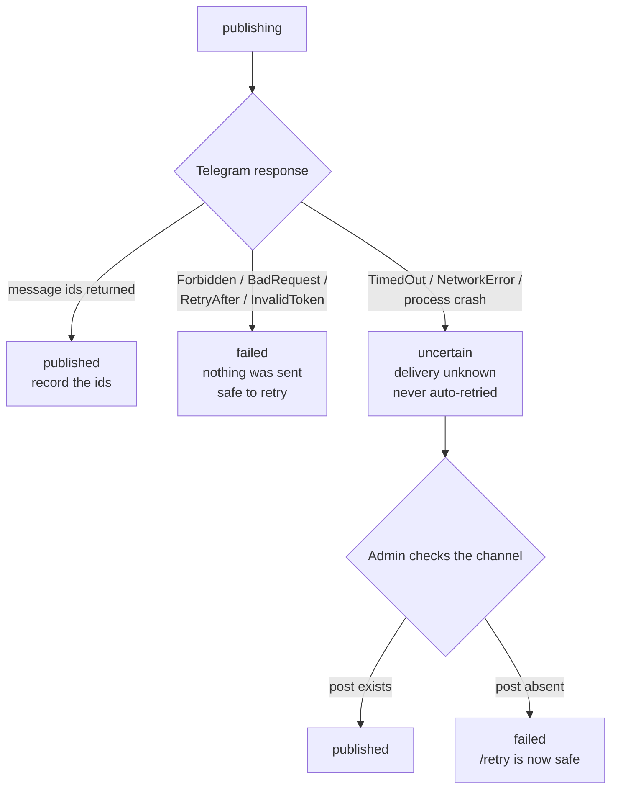

<div align="center">

# 📡 AniWave

### Publish once. Publish everywhere. Never publish twice.

**A production-grade Telegram publishing bridge that turns forum topics into a curated media channel.**

[](https://www.python.org/downloads/)
[](https://docs.python-telegram-bot.org/en/v21.11.1/)
[](https://www.sqlite.org/)
[](https://github.com/Md-Moklesar-Rahman-Bappy/aniwave/actions/workflows/tests.yml)
[](https://github.com/Md-Moklesar-Rahman-Bappy/aniwave)
[](LICENSE)
[](https://learn.microsoft.com/windows/)
[](LICENSE)

</div>

---

## 📖 Table of Contents

- [Overview](#-overview)
- [Features](#-features)
- [Screenshots](#-screenshots)
- [Architecture](#-architecture)
- [Project Structure](#-project-structure)
- [Technology Stack](#-technology-stack)
- [Installation](#-installation)
- [Configuration](#-configuration)
- [Topic Setup](#-topic-setup)
- [How Publishing Works](#-how-publishing-works)
- [Supported Media](#-supported-media)
- [MKV Support](#-mkv-support)
- [Commands](#-commands)
- [Database](#-database)
- [State Machine](#-state-machine)
- [Security](#-security)
- [Backup and Restore](#-backup-and-restore)
- [Testing](#-testing)
- [Troubleshooting](#-troubleshooting)
- [Roadmap](#-roadmap)
- [Contributing](#-contributing)
- [License](#-license)
- [Disclaimer](#-disclaimer)

---

## 💡 Overview

### What is AniWave?

AniWave is a self-hosted Telegram automation service that receives media from a private **forum supergroup**, organises it by **topic**, and publishes approved content to a public **channel**. Admins upload a file into a topic; the bot validates the upload, persists it, generates a channel-ready caption, and publishes it — immediately or after a human press of **Publish**.

### Who is it for?

- **Channel operators** who need a repeatable, auditable upload → publish pipeline instead of manual re-uploading.
- **Small teams** distributing content they own or are licensed to distribute, who need per-series topic organisation.
- **Engineers** who want a small, dependency-light, fully tested async service they can read end to end — no web framework, no ORM, no message broker.

### Problems it solves

| Problem | How AniWave solves it |
|---|---|
| Uploads get lost or silently dropped | Every rejection is logged with an explicit `reason=`; nothing disappears quietly. |
| The same file gets posted twice | `UNIQUE(source_chat_id, source_message_id)` plus a `file_unique_id` check makes ingestion idempotent. |
| A crash mid-publish creates duplicates | Every send is gated by an atomic compare-and-set; ambiguous outcomes become `uncertain`, never a blind retry. |
| Multi-gigabyte files are expensive to move | Telegram's `file_id` is reused. Nothing is downloaded or transcoded on your machine. |
| Adding a new series requires code changes | Any `<NAME>_TOPIC_ID` environment variable registers a new topic automatically. |
| Episode numbers are inconsistent | Captions are parsed for episode numbers, with noise (`1080p`, `x265`) explicitly excluded. |
| Secrets leak into logs or git | Startup secret scanning, log redaction filters, and a git-ignored `.env`. |

### Core workflow

```
Admin uploads into a configured topic  →  Bot validates  →  Bot persists to SQLite
      →  Bot publishes (auto or approved)  →  Channel post  →  State recorded
```

---

## ✨ Features

### Publishing

| | Feature | Description |
|---|---|---|
| ⚡ | **Automatic mode** | `AUTO_PUBLISH=true` publishes the moment a valid upload lands. |
| 🛡️ | **Approval mode** | `AUTO_PUBLISH=false` holds every record behind **Publish / Edit Episode / Cancel** buttons. |
| 🧩 | **Single media** | Video, animation, audio, photo, and documents each dispatch to the correct Bot API method. |
| 📚 | **Album publishing** | Multi-part media groups are collected, validated, and sent as one album. |
| ✏️ | **Edit Episode** | A guided conversation corrects a wrong episode number and live-refreshes the preview. |
| 🔁 | **Retry system** | `/retry` re-attempts only `failed` records, and refuses every other state with a clear reason. |
| 🚦 | **Publishing gate** | No send happens without an atomic `pending → publishing` claim. |

### Media Processing

| | Feature | Description |
|---|---|---|
| 🔍 | **Truthiness-based detection** | Absent media is `None` *or* an empty tuple in PTB; every presence check uses truthiness. |
| 🧠 | **Logical classification** | `video_document` vs `document` decided by extension first, MIME type second. |
| 📝 | **Episode detection** | Understands `EP 1165`, `Episode 25`, `12.5`, and a bare `1165`. |
| 🛡️ | **Noise rejection** | `1080p`, `x264`, `x265`, `BluRay`, `10bit` are never mistaken for an episode number. |
| 📐 | **Caption fitting** | Captions are trimmed to Telegram's 1024-character limit by shedding optional blocks. |
| 🚫 | **No MarkdownV2** | Captions are plain text, so `.`, `-`, and `@` can never trigger a `BadRequest`. |
| 📦 | **Zero local transfers** | Files are republished by `file_id`; a 1.2 GB MKV costs no bandwidth locally. |

### Topic Management

| | Feature | Description |
|---|---|---|
| 🗂️ | **Forum-topic routing** | Each upload is routed by `message_thread_id` to its configured topic. |
| ⚙️ | **Dynamic topics** | Any `<NAME>_TOPIC_ID` variable becomes a topic — no code change, no deploy. |
| 🏷️ | **Derived titles** | `ONE_PIECE_TOPIC_ID=23` becomes the topic **One Piece**. |
| 🔒 | **Unconfigured topics rejected** | Uploads into an unregistered topic are refused with `reason=unconfigured-topic`. |
| 🚫 | **Duplicate topic guard** | Two variables mapped to the same topic id fail fast at startup. |

### Administration

| | Feature | Description |
|---|---|---|
| 🆔 | **Numeric-id authorisation** | Access is granted by numeric Telegram id only — never by username, which is reassignable. |
| 📊 | **`/status` counters** | Per-state record counts for single uploads and albums, plus database health. |
| 🩺 | **`/debug` diagnostics** | Chat id, chat type, thread id, admin flag, topic mapping, detected media type. |
| 🆔 | **`/chatid` and `/topicid`** | Discover the exact ids you need for `.env` without leaving Telegram. |
| 🕵️ | **`/uncertain` review** | Lists interrupted publications that need a human decision. |
| 🔐 | **Id-scoped callbacks** | Callback data is a validated `aw:<action>:<kind>:<id>` grammar; forged payloads are rejected. |

### Reliability

| | Feature | Description |
|---|---|---|
| 🧠 | **SQLite as source of truth** | All state is on disk; in-memory schedulers are never authoritative. |
| 💥 | **Crash recovery** | On startup, records stuck in `publishing` become `uncertain` and admins are notified. |
| 🚫 | **No runtime-only queues** | Album finalisation survives restarts by design, with no APScheduler dependency. |
| 🔒 | **Compare-and-set transitions** | Every state change is `UPDATE … WHERE id=? AND status IN (…)`. |
| ⏱️ | **Edit session expiry** | A 5-minute deadline enforced in code, because PTB's own timeout needs an uninstalled extra. |
| 🔇 | **Rate-limit safety** | Admin error notices are throttled to one per 60 seconds. |

### Security

| | Feature | Description |
|---|---|---|
| 🔑 | **Token protection** | `.env` is git-ignored; only a sanitised `.env.example` is tracked. |
| 🕵️ | **Startup secret scan** | The working tree is scanned for token-shaped strings; startup aborts on a hit. |
| 🧽 | **Log redaction** | A logging filter scrubs both known secrets and anything token-shaped from every record. |
| 🚧 | **Preflight gate** | Leaked credentials are reported by file location only — never by value. |
| ✋ | **Bot-sender block** | Uploads from other bots are rejected outright. |
| 🔁 | **Replay protection** | Duplicate Telegram updates are absorbed idempotently at the database layer. |

### Database

| | Feature | Description |
|---|---|---|
| 🗄️ | **Async SQLite** | `aiosqlite` with WAL mode, executed off the event loop. |
| 🔢 | **Versioned schema** | `PRAGMA user_version` drives additive, idempotent migrations. |
| ➕ | **Schema v3** | Adds `telegram_media_type`, `logical_media_type`, `file_name`, `mime_type`, `file_size`. |
| 🔗 | **Referential integrity** | `album_items.album_id` cascades on album delete. |
| ⚡ | **Targeted indexes** | Partial indexes on status, uncertain rows, and media-group lookups. |
| 🔒 | **Uniqueness constraints** | One row per source message; one album row per media group. |

### Monitoring

| | Feature | Description |
|---|---|---|
| 🧾 | **Structured logging** | Machine-parseable `event=` keys on every meaningful step. |
| 🔍 | **Rejection reasons** | `no-user`, `unconfigured-topic`, `unsupported-media`, and more. |
| ⏱️ | **Bounded notices** | Repeated failures never flood the source group. |
| 🪟 | **Emoji-safe console** | stdout/stderr are re-encoded to UTF-8, so Windows `cp1252` cannot crash the bot. |
| 🔇 | **Quiet libraries** | `telegram`, `httpx`, and updater loggers are pinned to `WARNING` or above. |

---

## 📸 Screenshots

> Screenshot binaries are not committed to this repository. The paths below are the documented capture slots under `docs/images/`; each row states exactly what to capture and where it is used.

| Capture | Image path | What to capture | Status |
|---|---|---|---|
| Dashboard | `docs/images/dashboard.png` | Web dashboard with queue and analytics | 🔜 Roadmap — not implemented yet |
| Topic Detection | `docs/images/topic-detection.png` | `/topicid` reply showing `Message thread id` and `Configured here` | 📷 Ready to capture |
| Media Upload | `docs/images/media-upload.png` | Preview card with **Publish / Edit Episode / Cancel** | 📷 Ready to capture |
| Queue | `docs/images/queue.png` | `/status` output with per-state counters | 📷 Ready to capture |
| Publishing | `docs/images/publishing.png` | "Published successfully" reply with channel message ids | 📷 Ready to capture |
| Search | `docs/images/search.png` | Rich search results across published records | 🔜 Roadmap — not implemented yet |

### Topic Detection

```text
Topic information

Message thread id: 33
Configured here: 📁 Web Series

Put the Message thread id into the matching variable in your .env file.
```

### Publishing confirmation

```text
Published successfully

Topic: 📁 Web Series
Anime: Web Series
Episode: 1
Channel message id(s): 9001
```

---

## 🏗 Architecture

### Diagram 1 — System overview



### Diagram 2 — Publication state machine



### Diagram 3 — Album flow



---

## 📂 Project Structure

```text
aniwave/
├── .env.example              # Sanitised configuration template (tracked)
├── .gitignore                # Secrets, databases, logs, caches, venvs
├── LICENSE                   # MIT license text
├── README.md                 # This document
├── albums.py                 # Durable album collection + finalisation
├── bot.py                    # Entry point, lifecycle, logging, error handling
├── caption.py                # Episode parsing/validation + caption generation
├── config.py                 # Env loading, validation, redaction, secret scan
├── database.py               # Async SQLite, schema v3, CAS state transitions
├── docs/
│   └── images/               # Screenshot capture slots
├── handlers.py               # Commands, media intake, callbacks, conversation
├── media.py                  # Central media detection and extraction
├── publisher.py              # Caption building, dispatch, outcome classification
├── pytest.ini                # asyncio_mode = auto, testpaths = tests
├── requirements.txt          # Exactly pinned runtime + test dependencies
├── start.bat                 # Windows launcher with preflight checks
├── tests/
│   ├── __init__.py
│   ├── conftest.py                 # FakeBot + real-PTB update builders
│   ├── test_album_regression.py    # Album collection regressions
│   ├── test_albums.py              # Album service and reconciler
│   ├── test_bot.py                 # Lifecycle, logging, wiring, preflight
│   ├── test_caption.py             # Episode parsing and caption fitting
│   ├── test_config.py              # Validation and topic discovery
│   ├── test_database.py            # Schema, migrations, CAS transitions
│   ├── test_edit_conversation.py   # Edit Episode workflow
│   ├── test_filters.py             # SupportedMediaFilter behaviour
│   ├── test_handlers.py            # Routing, callbacks, authorisation
│   ├── test_mkv_document.py        # Document/MKV publication regression
│   ├── test_publisher.py           # Dispatch and error classification
│   ├── test_regressions.py         # Cross-cutting regressions
│   └── test_security.py            # Redaction and secret scanning
└── ui.py                    # Callback encoding, keyboards, message text
```

### File responsibilities

| File | Responsibility | Key invariant |
|---|---|---|
| `bot.py` | Application wiring, lifecycle hooks, logging, error handler, preflight | Exactly **one** `Database` instance is shared by every component. |
| `config.py` | Loads `.env`, validates everything, redacts secrets, scans for leaks | Validation is fail-fast and reports **all** problems at once. |
| `media.py` | The single source of truth for "what media is this?" | Presence is tested with **truthiness**, never `is not None`. |
| `handlers.py` | Commands, media intake, callback routing, Edit Episode conversation | Authorisation is by numeric id from `ADMIN_IDS` only. |
| `database.py` | Async SQLite access, additive migrations, atomic state transitions | Every transition is a compare-and-set on `status`. |
| `publisher.py` | Caption building, representation-aware dispatch, outcome classification | Telegram errors are split into **clear** vs **uncertain**. |
| `albums.py` | Collects album parts durably and finalises settled albums | SQLite, not an in-memory scheduler, is authoritative. |
| `caption.py` | Episode extraction and plain-text caption generation | Required caption lines are never dropped when trimming. |
| `ui.py` | Callback grammar, inline keyboards, all admin-facing text | Plain text only — no MarkdownV2 anywhere. |

Runtime artefacts (`aniwave.db`, `aniwave.db-wal`, `aniwave.db-shm`, `.coverage`, `__pycache__/`) are generated locally and git-ignored.

---

## 🧰 Technology Stack

| Layer | Choice | Version | Why |
|---|---|---|---|
| Language | Python | 3.14 | Native `asyncio`, `zoneinfo`, modern typing. |
| Telegram framework | `python-telegram-bot` | 21.11.1 | Async PTB v21 with `ApplicationBuilder` and `ConversationHandler`. |
| Configuration | `python-dotenv` | 1.0.1 | 12-factor `.env` loading. |
| Database driver | `aiosqlite` | 0.20.0 | Async SQLite without blocking the event loop. |
| Timezone data | `tzdata` | 2026.5 | **Required on Windows** — the interpreter ships no IANA database. |
| Database | SQLite | 3 | Single-file, transactional, zero administration. |
| Concurrency | `asyncio` | stdlib | One polling loop, cooperative background tasks. |
| Testing | `pytest` | 9.1.1 | `asyncio_mode = auto`, 594 tests. |
| Async testing | `pytest-asyncio` | 1.4.0 | Native coroutine test support. |
| Coverage | `pytest-cov` | 7.1.0 | 97% line coverage across the package. |

**Runtime dependencies are exactly pinned.** There is no web framework, no ORM, and no scheduler dependency — the whole service is the standard library plus four packages.

---

## 🚀 Installation

### Prerequisites

- Windows 10/11 (also runs on Linux and macOS)
- [Python 3.14](https://www.python.org/downloads/) — check with `python --version`
- A Telegram bot token from [@BotFather](https://t.me/BotFather)
- Admin rights in the source forum supergroup and the target channel

### Git Bash

```bash
# 1. Clone
git clone https://github.com/Md-Moklesar-Rahman-Bappy/aniwave.git
cd aniwave

# 2. Create and activate a virtual environment
python -m venv .venv
source .venv/Scripts/activate

# 3. Install exactly pinned dependencies
python -m pip install --upgrade pip
python -m pip install -r requirements.txt

# 4. Create your local configuration
cp .env.example .env

# 5. Start
python bot.py
```

### PowerShell

```powershell
# 1. Clone
git clone https://github.com/Md-Moklesar-Rahman-Bappy/aniwave.git
Set-Location aniwave

# 2. Create and activate a virtual environment
python -m venv .venv
.\.venv\Scripts\Activate.ps1

# 3. Install exactly pinned dependencies
python -m pip install --upgrade pip
python -m pip install -r requirements.txt

# 4. Create your local configuration
Copy-Item .env.example .env

# 5. Start
python bot.py
```

> If PowerShell blocks activation, run once:
> `Set-ExecutionPolicy -Scope Process -ExecutionPolicy Bypass`

### Windows Command Prompt

```bat
git clone https://github.com/Md-Moklesar-Rahman-Bappy/aniwave.git
cd aniwave
python -m venv .venv
.venv\Scripts\activate
python -m pip install --upgrade pip
python -m pip install -r requirements.txt
copy .env.example .env
python bot.py
```

### Using the launcher

Double-click **`start.bat`**. It changes into its own directory, prefers `.venv` when present, fails early with a clear message if `.env` is missing, and keeps the window open so errors stay readable.

> ⚠️ **Only one polling instance may run per bot token.** Telegram rejects a second `getUpdates` from the same token. Close every other window before starting.

---

## ⚙️ Configuration

All configuration lives in `.env`, created from the tracked template:

```bash
cp .env.example .env      # Git Bash
Copy-Item .env.example .env   # PowerShell
```

### Required variables

| Variable | Type | Example | Description |
|---|---|---|---|
| `TELEGRAM_BOT_TOKEN` | string | `123456789:AA...` | Bot token from [@BotFather](https://t.me/BotFather). **Never commit it, never paste it in a chat.** |
| `SOURCE_GROUP_ID` | integer | `-1001234567890` | Numeric id of the source forum supergroup. Discover it with `/chatid`. |
| `TARGET_CHANNEL` | string | `@your_channel` | Destination channel or `-100…` chat id. Always kept as a string. |
| `ADMIN_IDS` | csv integers | `123456789,987654321` | Telegram user ids allowed to publish and approve. Duplicates are removed. |
| `WEB_SERIES_TOPIC_ID` | integer | `33` | Forum topic id for the Web Series topic. Discover it with `/topicid`. |
| `AUTO_PUBLISH` | boolean | `false` | `true` publishes immediately; `false` requires approval. |
| `INCLUDE_HD_CLAIM` | boolean | `false` | Whether generated captions claim "HD Quality". |
| `TIMEZONE` | IANA zone | `Asia/Dhaka` | Validated at startup via `zoneinfo`. |
| `DATABASE_PATH` | path | `aniwave.db` | SQLite file, relative to the project root. |
| `LOG_LEVEL` | enum | `INFO` | `DEBUG`, `INFO`, `WARNING`, `ERROR`, or `CRITICAL`. |

### Optional variables

| Variable | Type | Default | Range | Description |
|---|---|---|---|---|
| `ALBUM_QUIET_SECONDS` | integer | `3` | `1`–`120` | Quiet period after the last album part before finalisation. |
| `<ANY>_TOPIC_ID` | integer | — | unique | Registers an extra topic. The title is derived from the variable name. |

### Dynamic topic registration

Any variable ending in `_TOPIC_ID` becomes a topic automatically — **no code change required**:

```dotenv
WEB_SERIES_TOPIC_ID=33    # Required: declared in config.TOPIC_SPECS
ONE_PIECE_TOPIC_ID=23     # Auto-registered as "One Piece"
NARUTO_TOPIC_ID=6         # Auto-registered as "Naruto"
MOVIE_NAME_TOPIC_ID=43    # Auto-registered as "Movie Name"
```

Rules the bot enforces:

- Names are matched **case-sensitively**: use `WEB_SERIES_TOPIC_ID`, never `Web_Series_TOPIC_ID`.
- `WEB_SERIES_TOPIC_ID` is required because it is declared in `config.TOPIC_SPECS`.
- Duplicate topic ids across variables are rejected at startup.
- Titles are derived by title-casing the prefix: `ONE_PIECE` → `One Piece`.

### Boolean values

`AUTO_PUBLISH` and `INCLUDE_HD_CLAIM` accept:

```text
true   1   yes   on
false  0   no    off
```

Anything else fails fast with a message naming the offending variable.

---

## 🗺 Topic Setup

### Step 1 — Find the source group id

Add the bot to your forum supergroup, make it an administrator, enable **Manage Topics**, then send:

```text
/chatid
```

```text
Chat information

Chat id: -1001234567890
Chat type: supergroup
Chat title: AniWave Source
Your user id: 123456789
```

### Step 2 — Find each topic id

Open the topic inside the forum and send:

```text
/topicid
```

```text
Topic information

Message thread id: 33
Configured here: 📁 Web Series

Put the Message thread id into the matching variable in your .env file.
```

`Configured here: not configured` means the bot does not know that topic yet.

### Step 3 — Diagnose with `/debug`

`/debug` is the most informative command — it answers every configuration question at once:

```text
Debug

App version: 1.0.0
Chat id: -1001234567890
Chat type: supergroup
Message thread id: 33
User id: 123456789
Is configured source chat: yes
Is admin: yes
Configured topic: 📁 Web Series
Publishing mode: approval
Media type: document
Media group id: -1
```

### Step 4 — Register the topic

Add the discovered id to `.env`, then restart the bot and confirm with `/status`:

```dotenv
WEB_SERIES_TOPIC_ID=33
```

```text
Configured topics:
  📁 Web Series -> topic id 33
```

### Topic checklist

- [ ] Source group has **Topics** enabled
- [ ] Bot is an administrator with **Manage Topics**
- [ ] Bot is an administrator of the target channel with **Post Messages**
- [ ] Every uploader's numeric id is listed in `ADMIN_IDS`
- [ ] Each topic used for uploads has a matching `<NAME>_TOPIC_ID` variable
- [ ] `/status` lists every topic you expect

---

## ⚡ How Publishing Works

```text
        ┌──────────────────────────┐
        │  Upload                  │
        │  Admin posts media into  │
        │  a configured topic      │
        └────────────┬─────────────┘
                     ▼
        ┌──────────────────────────┐
        │  Validation              │
        │  supergroup · source id  │
        │  admin id · topic id ·   │
        │  media type · not edited │
        └────────────┬─────────────┘
                     ▼
        ┌──────────────────────────┐
        │  Database                │
        │  Insert with UNIQUE      │
        │  (chat, message) guard   │
        └────────────┬─────────────┘
                     ▼
        ┌──────────────────────────┐
        │  Publishing              │
        │  Claim CAS → send by     │
        │  representation          │
        └────────────┬─────────────┘
                     ▼
        ┌──────────────────────────┐
        │  Channel                 │
        │  Record ids + final      │
        │  state in SQLite         │
        └──────────────────────────┘
```

### Step-by-step

1. **Upload** — an admin sends video, animation, audio, a photo, a document, or an album into a configured forum topic. Commands are never consumed by the media handler.
2. **Validation** — `_media_route` checks, in order: message present, user present, sender is not a bot, message not edited, chat present, chat is a supergroup, chat id matches `SOURCE_GROUP_ID`, sender is in `ADMIN_IDS`, thread id present, and topic configured. Any failure logs `event=media-rejected reason=…`.
3. **Database** — a `media_items` row is inserted with the original Telegram representation, logical type, file name, MIME type, and size. A duplicate source message is logged as `event=media-duplicate` and dropped.
4. **Publishing** — in automatic mode the bot publishes immediately; in approval mode it posts a preview with **Publish / Edit Episode / Cancel**. Either way, an atomic compare-and-set must move the row from `pending` (or `failed`) to `publishing` before any Telegram call happens.
5. **Channel** — on success the channel message ids and the final caption are written back, and the row becomes `published`.

### Episode detection

The caption is scanned for an episode number before publishing:

| Caption | Episode |
|---|---|
| `One Piece EP 1165` | `1165` |
| `Naruto Episode 25` | `25` |
| `12.5` | `12.5` |
| `1165` | `1165` |
| `EP -3` | rejected — a hyphen is not a separator |
| `1080p x265 BluRay` | none — resolution and codec noise is excluded |

Numbers are normalised: `00125` → `125`, `12.50` → `12.5`, `12.0` → `12`. Decimals are capped at four places and must be greater than zero.

If no episode number is found, the upload is stored but **not** published. The bot replies with guidance and offers **Edit Episode**.

### Generated caption

```text
🔥 NEW EPISODE RELEASED 🔥

📁 Web Series

📺 Episode: 1
🎙 Audio: Japanese
💬 Subtitle: Bangla

━━━━━━━━━━━━━━
✅ Regular Updates
━━━━━━━━━━━━━━

📢 Channel: @your_channel
```

---

## 📼 Supported Media

| Media type | Supported | Telegram attribute | Publish method | Notes |
|---|---|---|---|---|
| Video | ✅ | `message.video` | `send_video(supports_streaming=True)` | Native streaming enabled. |
| Document | ✅ | `message.document` | `send_document` | Always works; used for MKV. |
| MKV (`.mkv`) | ✅ | `message.document` | `send_document` | Classified `video_document`, published as a document. |
| MP4 (`.mp4`, `.m4v`, `.mov`, `.webm`) | ✅ | `message.document` | `send_video` first, `send_document` on `BadRequest` | Native attempt happens once; fallback only on a definite rejection. |
| Audio | ✅ | `message.audio` | `send_audio` | Metadata only; the `file_id` is reused. |
| Photo | ✅ | `message.photo` | `send_photo` | The largest available size is selected. |
| Animation | ✅ | `message.animation` | `send_animation` | — |
| Album | ✅ | `media_group_id` set | `send_media_group` | 2–10 parts, sent to the album service first. |
| Text | ❌ | — | — | Commands are handled by command handlers. |
| Sticker / voice / contact / other | ❌ | — | — | Rejected with `reason=unsupported-media`. |

### Album rules

Telegram's `sendMediaGroup` is stricter than a single send, so albums are validated **before** anything is claimed:

| Rule | Reason |
|---|---|
| 2 to 10 parts | Telegram's hard limit for a media group. |
| Photos and videos may be mixed | Telegram allows only photo/video mixing. |
| Other types must be homogeneous | An album of `audio` + `document` cannot be represented. |
| Album items cannot mix photos/videos with anything else | Telegram rejects the whole group. |
| Re-validation at finalisation time | A topic can be reconfigured while an album is collecting. |

### Rejection reasons

Every ignored upload is logged with one of these reasons:

| `reason=` | Meaning |
|---|---|
| `no-message` | The update carried no message. |
| `no-user` | No sender could be resolved. |
| `bot-sender` | The sender is another bot. |
| `edited-message` | The message was edited after sending. |
| `no-chat` | No chat could be resolved. |
| `not-a-supergroup` | The chat is not a forum supergroup. |
| `wrong-source-chat` | The chat id is not `SOURCE_GROUP_ID`. |
| `unauthorized-user` | The sender is not in `ADMIN_IDS`. |
| `no-topic` | The message is not inside a forum topic. |
| `unconfigured-topic` | The topic id has no `<NAME>_TOPIC_ID` entry. |
| `unsupported-media` | No supported media attribute was present. |

---

## 🎬 MKV Support

### Telegram treats MKV as a document

This is a **Telegram Bot API limitation**, not an AniWave choice. Telegram cannot transcode a Matroska container, so an `.mkv` upload always arrives as `message.document` and is never promoted to `message.video`. No bot can change this.

### AniWave publishes MKV safely

AniWave records the original Telegram representation and republishes through the matching method:

```text
telegram_media_type = document
logical_media_type  = video_document
file_name           = Suits S01E01 1080p BluRay x265 HEVC ESub.mkv
mime_type           = video/x-matroska
publish method      = send_document
```

The file is **accepted, recorded, and published** — it is never silently dropped.

### Native streaming depends on Telegram

| Container | Telegram native player | What AniWave does |
|---|---|---|
| `.mp4`, `.m4v`, `.mov`, `.webm` | ✅ Usually | Tries `send_video` once, falls back to `send_document` only on `BadRequest`. |
| `.mkv` | ❌ Not supported | Sends with `send_document`. |

Subscribers download MKV files rather than streaming them in-app. That is a Telegram client limitation, outside this project's control.

### MKV is never converted

AniWave performs **no download, no remux, and no transcode**. It reuses Telegram's own `file_id`, so republishing a 1.2 GB MKV consumes no local bandwidth and no CPU. This is also why nothing is ever executed inside the asyncio event loop.

### The bug that MKV exposed

An earlier version probed media with `getattr(message, attr, None) is not None`. In python-telegram-bot 21.11.1, absent media is `None` for `video`/`animation`/`audio`/`document` but an **empty tuple `()` for `photo`** — so `() is not None` matched `photo` first, classified every message as a photo, and returned early before any database row was created. Documents, including MKV, vanished.

The fix is centralised in `media.py`, which tests presence by **truthiness**. Regression coverage lives in `tests/test_mkv_document.py` using real `telegram.*` objects rather than hand-rolled stubs.

---

## ⌨️ Commands

All commands are admin-only. A non-admin invocation is refused and logged as `auth-rejected`.

| Command | Arguments | Description |
|---|---|---|
| `/start` | — | Status and configuration overview. |
| `/help` | — | Full usage help and the list of configured topics. |
| `/status` | — | Record counters per state for single uploads and albums, plus database health. |
| `/debug` | — | Safe diagnostics: chat id, chat type, thread id, admin flag, topic mapping, media type. |
| `/chatid` | — | Numeric chat id, chat type, chat title, and your own user id. |
| `/topicid` | — | Numeric topic id for the current topic and whether it is configured. |
| `/retry` | `<id>` \| `m:<id>` \| `a:<id>` | Retry a **failed** record. Refuses every other state with an explanation. |
| `/uncertain` | — | List interrupted publications awaiting a manual decision. |
| `/cancel` | — | Abandon an active Edit Episode session. |

### Inline buttons

| Button | Where it appears | Action |
|---|---|---|
| **Publish** | Preview card | Publishes a `pending` record. |
| **Edit Episode** | Preview card | Opens the 5-minute episode-number conversation. |
| **Cancel** | Preview card | Moves a `pending` or `failed` record to `canceled`. |
| **Already published** | Uncertain card | Confirms the channel post exists → `published`. |
| **Not published** | Uncertain card | Asks for confirmation, then allows a retry. |
| **Yes, it is not published — allow retry** | Confirmation card | `uncertain` → `failed`, retryable via `/retry`. |
| **No, keep as uncertain** | Confirmation card | Leaves the record `uncertain`. |

### `/retry` semantics

`/retry` is deliberately strict, because a careless retry is how channels get duplicate posts:

| Current state | Response |
|---|---|
| `failed` | ✅ Retried |
| `uncertain` | ⚠️ Refused — check the channel first, then resolve with `/uncertain` |
| `published` | ℹ️ Already published |
| `canceled` | 🚫 Canceled records cannot be retried |
| `publishing` | ℹ️ Already in progress |
| `pending` | ℹ️ Press **Publish** on the preview instead |

### Planned commands

`/search` — full-text search across published records — is on the [roadmap](#-roadmap) and is **not** available in this release.

---

## 🗄 Database

Schema version **3**, stored in a single SQLite file with WAL mode.

### Tables

#### `media_items` — single uploads

| Column group | Columns |
|---|---|
| Identity | `id`, `source_chat_id`, `source_message_id`, `media_group_id`, `topic_id`, `sender_id` |
| Media | `media_type`, `file_id`, `file_unique_id`, `caption` |
| Metadata *(v3)* | `telegram_media_type`, `logical_media_type`, `file_name`, `mime_type`, `file_size` |
| Classification | `anime_title`, `emoji`, `episode_number`, `final_caption` |
| State | `status`, `uncertain`, `version`, `last_error` |
| Publishing | `target_chat_id`, `target_message_id`, `published_at`, `publishing_started_at` |
| UI | `preview_message_id` |
| Audit | `created_at`, `updated_at` |

Constraint: `UNIQUE(source_chat_id, source_message_id)` — one row per source message, which is what makes ingestion idempotent.

#### `albums` — album headers

| Column group | Columns |
|---|---|
| Identity | `id`, `source_chat_id`, `media_group_id`, `topic_id`, `sender_id` |
| Content | `anime_title`, `emoji`, `episode_number`, `final_caption`, `expected_size`, `item_count` |
| State | `status`, `uncertain`, `version`, `last_error` |
| Publishing | `target_chat_id`, `target_message_ids`, `published_at`, `publishing_started_at` |
| Timing | `last_item_received_at`, `created_at`, `updated_at` |

Constraint: `UNIQUE(source_chat_id, media_group_id)`.

#### `album_items` — album parts

| Column | Purpose |
|---|---|
| `id` | Primary key |
| `album_id` | Foreign key → `albums(id)`, `ON DELETE CASCADE` |
| `source_chat_id`, `source_message_id` | Origin of the part |
| `ordinal` | Position, assigned at finalisation |
| `media_type`, `file_id` | What to republish |
| `original_caption` | Kept so the episode number can be resolved from any part |
| `created_at` | Arrival time |

Constraints: `UNIQUE(album_id, source_message_id)` and `UNIQUE(source_chat_id, source_message_id)`.

#### `topics` — configuration, not a table

There is deliberately **no `topics` table**. Topics come from `.env` via `config.TOPIC_SPECS` plus dynamic `<NAME>_TOPIC_ID` discovery, and are stored on each record as `topic_id`, `anime_title`, and `emoji`. Configuration is the source of truth for routing; the database only records what was resolved at intake.

### Entity relationships



`album_items` belongs to exactly one `album`. `media_items` and `albums` are independent intake records — a message with a `media_group_id` becomes an album part, never a `media_items` row.

### Migrations

Schema versions are tracked in `PRAGMA user_version`. Upgrades are **additive and idempotent**: each column set is applied only if missing, so v1, v2, and v3 databases all converge on v3 without data loss.



Inspect your database safely:

```bash
sqlite3 aniwave.db "PRAGMA user_version; SELECT status, COUNT(*) FROM media_items GROUP BY status;"
```

---

## 🔄 State Machine

Every record moves through a small, explicit state machine. Transitions are compare-and-set operations — `UPDATE … WHERE id = ? AND status IN (…)` — so two concurrent attempts can never both win.

### States

| State | Meaning | Entered when |
|---|---|---|
| `collecting` | An album is still receiving parts. | The first part of a media group arrives. |
| `pending` | Stored and ready to publish. | A single upload is stored, or a collecting album is finalised. |
| `publishing` | A Telegram send is in flight. | An atomic claim succeeds immediately before the send. |
| `published` | The channel post exists; ids are recorded. | Telegram returns message ids. |
| `failed` | A definite rejection; **safe to retry**. | Telegram refuses the request, or an album is invalid. |
| `uncertain` | The bot stopped mid-send; the post **may or may not** exist. | A timeout, network error, or crash occurs during publishing. |
| `canceled` | An admin discarded the record. | **Cancel** is pressed. |

### Allowed transitions

| From | To | Trigger |
|---|---|---|
| `collecting` | `pending` | Quiet period elapsed; finalisation succeeded. |
| `pending` | `publishing` | Publish claimed atomically. |
| `pending` | `canceled` | **Cancel** pressed. |
| `failed` | `publishing` | `/retry` or **Publish**. |
| `failed` | `canceled` | **Cancel** pressed. |
| `publishing` | `published` | Send succeeded. |
| `publishing` | `failed` | Clear rejection (`Forbidden`, `BadRequest`, `RetryAfter`, `InvalidToken`). |
| `publishing` | `uncertain` | Ambiguous failure (`TimedOut`, `NetworkError`, crash). |
| `uncertain` | `published` | Admin confirms the post exists. |
| `uncertain` | `failed` | Admin confirms the post is absent; retry becomes safe. |

### Why `uncertain` exists

Most publishing bugs eventually become "the bot posted it twice". The distinction between **failed** and **uncertain** is what prevents that:



A `failed` record is always safe to retry. An `uncertain` record is **never** retried automatically — not on a timer, not on restart. A human must look at the channel first. On startup, interrupted `publishing` records are moved to `uncertain` and admins are notified in the source group.

---

## 🔐 Security

### Token protection

- `.env` is git-ignored. Only `.env.example` — with an intentionally invalid placeholder — is tracked.
- `.env.*`, `*.env`, `.env.local`, and `.env.txt` are all ignored.
- **If a token is ever exposed** — in a chat, a screenshot, a commit, a log — revoke it through [@BotFather](https://t.me/BotFather) and generate a new one. Deleting the message does not un-leak the token.

### Secret scanning

Before the bot starts, `bot.preflight()` walks the working tree and looks for token-shaped strings:

```python
TOKEN_PATTERN = re.compile(r"\b\d{8,12}:[A-Za-z0-9_-]{30,40}\b")
```

A hit **aborts startup** and reports file locations only — never values:

```text
security-check-failed token_like_values=1 locations=.\config.py:42
```

### Log redaction

`SecretRedactionFilter` is attached to the root handler. It scrubs both literal known secrets and anything token-shaped from every record — message, arguments, and exception text — so an unexpected leak cannot reach the console or a log file:

```text
***REDACTED***
```

### Topic validation

An upload is refused unless its thread id maps to a configured topic. Combined with the source-chat and admin checks, this means a file dropped into a random topic or a random group is never published.

### Admin validation

- Authorisation compares numeric user ids from `ADMIN_IDS` — usernames are never trusted, because they can be changed or reassigned.
- Only admins can run commands, press inline buttons, or trigger a publish.
- The Edit Episode conversation is bound to the admin who started it, and expires after 5 minutes.
- At album finalisation, sender authorisation and topic mapping are **re-validated**, in case configuration changed while parts were arriving.

### Duplicate prevention

| Layer | Mechanism |
|---|---|
| Database | `UNIQUE(source_chat_id, source_message_id)` on `media_items` and `album_items` |
| Database | `UNIQUE(source_chat_id, media_group_id)` on `albums` |
| Publisher | Atomic `pending → publishing` claim before any Telegram call |
| Publisher | `failed` vs `uncertain` classification prevents unsafe retries |
| Handlers | Edited messages are rejected, so a re-upload cannot mutate a published record |

### Recovery system

On every startup the bot:

1. Moves any record stuck in `publishing` to `uncertain`.
2. Sends admins a message listing exactly which records need a channel check.
3. Finalises albums that were collecting when the process stopped.
4. Never auto-retries anything ambiguous.

### Security best practices

- [ ] Rotate the bot token through [@BotFather](https://t.me/BotFather) whenever it may have been exposed
- [ ] Keep `.env` out of version control; verify with `git check-ignore .env`
- [ ] Grant the bot only the permissions it needs — post messages in the channel, manage topics in the group
- [ ] Keep `ADMIN_IDS` minimal and remove people who leave the team
- [ ] Review `source_chat_id` and `target_channel` before every production change
- [ ] Run on a machine only you can access; `.env` is plaintext by design
- [ ] Back up `aniwave.db` on a schedule — it is the authoritative record of what was published
- [ ] Never commit `.env`, `aniwave.db`, or any `*.db-wal` / `*.db-shm` file

---

## 💾 Backup and Restore

`aniwave.db` is the authoritative record of what was published. Back it up.

### Consistent backup (recommended)

Stop the bot first, then use SQLite's online backup so the WAL is captured correctly:

```bash
# 1. Stop the bot with Ctrl+C and close the launcher window
# 2. Create a consistent copy
sqlite3 aniwave.db ".backup 'aniwave-backup-2026-10-04.db'"

# 3. Verify the copy
sqlite3 aniwave-backup-2026-10-04.db "PRAGMA integrity_check; PRAGMA user_version;"
```

PowerShell equivalent:

```powershell
sqlite3 aniwave.db ".backup 'aniwave-backup-2026-10-04.db'"
```

### Simple file copy

Only safe while the bot is **stopped**, so no `-wal` data is outstanding:

```bash
# Stop the bot first
cp aniwave.db aniwave-backup.db
cp aniwave.db-wal aniwave-backup.db-wal 2>/dev/null || true
cp aniwave.db-shm aniwave-backup.db-shm 2>/dev/null || true
```

### Export a readable snapshot

```bash
sqlite3 -header -column aniwave.db \
  "SELECT id, status, anime_title, episode_number, file_name, published_at
   FROM media_items ORDER BY id DESC LIMIT 50;"
```

```bash
sqlite3 -header -column aniwave.db \
  "SELECT status, COUNT(*) AS total FROM albums GROUP BY status;"
```

### Restore

```bash
# 1. Stop the bot
# 2. Move the current database aside - do not delete it yet
mv aniwave.db aniwave.db.broken
rm -f aniwave.db-wal aniwave.db-shm

# 3. Put the backup in place
cp aniwave-backup.db aniwave.db

# 4. Verify before starting
sqlite3 aniwave.db "PRAGMA integrity_check; PRAGMA user_version;"

# 5. Start the bot - migrations run automatically
python bot.py
```

### Back up `.env` separately

`.env` is never committed. Store a copy in a password manager, not in the repository:

```bash
# Verify it is ignored before you ever worry about it
git check-ignore -v .env
```

---

## 🧪 Testing

**594 tests · 97% coverage · zero warnings.**

The suite mocks the Telegram API boundary completely: no test ever contacts Telegram, and no test media is ever published to a real channel.

```bash
# Full suite
python -m pytest tests -v

# Collect only - useful for CI output and test-count verification
python -m pytest --collect-only -v

# With coverage
python -m pytest tests --cov=.

# Treat warnings as errors
python -m pytest tests -v -W error
```

### Module coverage

| Module | Coverage | Focus |
|---|---|---|
| `caption.py` | 100% | Episode parsing, normalisation, caption fitting |
| `ui.py` | 98% | Callback grammar, keyboards, message text |
| `database.py` | 96% | Migrations, CAS transitions, constraints |
| `config.py` | 95% | Validation, topic discovery, redaction |
| `publisher.py` | 95% | Dispatch, error classification, gate |
| `media.py` | 96% | Detection, extraction, classification |
| `handlers.py` | 90% | Routing, authorisation, conversations |
| `albums.py` | 92% | Collection, finalisation, reconciliation |
| `bot.py` | 84% | Lifecycle and startup/shutdown paths |

### Test strategy

| File | What it protects |
|---|---|
| `tests/conftest.py` | `FakeBot` with per-method call recording and error injection; real `telegram.*` update builders |
| `tests/test_mkv_document.py` | The document/MKV publication regression — 41 tests |
| `tests/test_album_regression.py` | Album collection and finalisation regressions — 19 tests |
| `tests/test_handlers.py` | Routing, rejection reasons, callbacks, authorisation |
| `tests/test_publisher.py` | Which `send_*` boundary is used per media type |
| `tests/test_database.py` | Schema, migrations, uniqueness, state transitions |
| `tests/test_security.py` | Redaction, secret scanning, callback validation |
| `tests/test_config.py` | Fail-fast validation and dynamic topic discovery |
| `tests/test_bot.py` | Wiring, logging setup, preflight, error handler |

> **Lesson encoded in the suite:** stubs must reproduce the library's real semantics. The original MKV bug survived because hand-rolled `FakeMessage` objects set absent media to `None`, while python-telegram-bot actually uses an empty tuple for `photo`. The regression tests therefore build **real** `telegram.*` objects.

---

## 🩺 Troubleshooting

| Symptom | Likely cause | Fix |
|---|---|---|
| **Bot does not publish anything** | Sender is not in `ADMIN_IDS` | Run `/debug` — `Is admin: no` confirms it. Add the numeric id and restart. |
| | Chat id is not `SOURCE_GROUP_ID` | `/debug` → `Is configured source chat: no`. Correct `SOURCE_GROUP_ID`. |
| | Topic is not configured | Look for `event=media-rejected reason=unconfigured-topic`. Add `<NAME>_TOPIC_ID`. |
| | Upload is outside a topic | `reason=no-topic`. Post inside a forum topic. |
| | Sender is a bot | `reason=bot-sender`. Only human admins can publish. |
| | Message was edited after sending | `reason=edited-message`. Send a new message instead of editing. |
| | No episode number found | The record is stored but held. Use **Edit Episode**, or fix the caption and `/retry`. |
| **Topic not configured** | Missing `<NAME>_TOPIC_ID` | Send `/topicid` inside the topic, add the id to `.env`, restart. |
| | Variable name casing | Names are case-sensitive | Use `WEB_SERIES_TOPIC_ID`, not `Web_Series_TOPIC_ID`. |
| | Two variables share one id | Startup aborts | Give every topic a unique id. |
| **MKV not publishing** | Telegram delivered it as a document | This is expected. It publishes via `send_document`; search the log for `logical=video_document`. |
| | No native playback | Telegram cannot transcode Matroska | Expected. Subscribers download the file. No conversion is performed. |
| **Environment variable missing** | `.env` absent or incomplete | `Copy-Item .env.example .env`. All problems are reported at once — fix every line listed. |
| | `.env` in the wrong directory | The launcher runs in its own folder | Start from the project root, or use `start.bat`. |
| **Database is locked** | Two instances running | Stop every other instance. Only one process may hold the database. |
| | Stale `-wal` / `-shm` after a crash | Stop the bot, then delete `aniwave.db-wal` and `aniwave.db-shm`; restart. |
| **`TelegramError: Forbidden`** | Bot lacks permission | Add the bot as an admin of the target channel with **Post Messages**. |
| | Bot was removed from the group | Re-add it with **Manage Topics**. |
| **Conflict: another instance is polling** | A second process uses the same token | Close every other window or service. One token, one poller. |
| **Startup secret scan fails** | A token-shaped string is in the tree | Remove it, keep only placeholders, and **rotate the token through BotFather**. |
| **UnicodeEncodeError on Windows** | Console codec is `cp1252` | AniWave re-encodes stdout to UTF-8 automatically. Run via `start.bat` or `python -X utf8 bot.py`. |
| **`InvalidToken` at startup** | Token revoked or mistyped | Issue a new token via BotFather and update `.env`. |
| **Rate limited** | Telegram `RetryAfter` | Recorded as `failed`; wait, then `/retry`. Nothing was published. |
| **Album never publishes** | Fewer than 2 parts, or mixed types | Check `/status` and the log for `album-rejected`. Send 2–10 homogeneous parts. |
| | Quiet period too long | Lower `ALBUM_QUIET_SECONDS` (range 1–120) and restart. |
| **Duplicate in the channel** | A record was retried while uncertain | Check `/uncertain`. `uncertain` records are never retried automatically — that is the safeguard. |

### Diagnostic log events

```text
event=media-received    chat=-100… message=1234 thread=33 telegram_type=document logical_type=video_document
event=media-accepted    topic='Web Series' admin=true telegram_type=document logical_type=video_document episode=1
event=media-created     item_id=1 chat=-100… message=1234 type=document episode=1
event=media-duplicate   chat=-100… message=1234
event=media-rejected    reason=unconfigured-topic chat=-100… thread=99 user=123456789
event=publish-start     item_id=1 chat=-100… message=1234 type=document logical=video_document mode=automatic
event=publish-success   item_id=1 target_message_ids=[9001]
event=publish-failed    item_id=1 reason=Telegram rejected the request: …
event=publish-uncertain item_id=1 reason=network timeout while publishing; delivery unknown
event=publish-gate-closed item_id=1 reason=state-changed
```

Set `LOG_LEVEL=DEBUG` for verbose output.

---

## 🗺 Roadmap

| | Feature | Status | Description |
|---|---|---|---|
| 🌐 | **FastAPI dashboard** | 🔜 Planned | Web UI for browsing records, albums, and states, with a live queue view. |
| 🔎 | **Rich search** | 🔜 Planned | Full-text search across published titles, episodes, and file names. |
| 📈 | **Analytics** | 🔜 Planned | Publish volume, failure rates, and per-topic throughput over time. |
| ⏰ | **Scheduled publishing** | 🔜 Planned | Queue records and release them at a chosen time. |
| 🧠 | **Topic auto-registration** | 🔜 Planned | Discover forum topics at runtime instead of declaring them in `.env`. |
| 🎞️ | **Metadata providers** | 🔜 Planned | Optional TVDB / TMDB / AniList lookups to enrich captions. |
| 🖼️ | **Thumbnail generator** | 🔜 Planned | Derive a poster frame or thumbnail for video and album posts. |
| ✅ | **Topic-based publishing** | ✅ Shipped | Forum topic routing with configuration-driven registry. |
| ✅ | **Album support** | ✅ Shipped | Durable collection, validation, and `sendMediaGroup` publication. |
| ✅ | **MKV document support** | ✅ Shipped | Representation-aware dispatch with regression coverage. |
| ✅ | **Publishing state machine** | ✅ Shipped | Seven states with atomic compare-and-set transitions. |
| ✅ | **Crash recovery** | ✅ Shipped | Startup reconciliation and `uncertain` review workflow. |
| ✅ | **Approval mode** | ✅ Shipped | Inline Publish / Edit Episode / Cancel controls. |
| ✅ | **Duplicate prevention** | ✅ Shipped | Database uniqueness plus a publish gate. |
| ✅ | **Structured logging** | ✅ Shipped | Machine-parseable events with explicit rejection reasons. |

---

## 🤝 Contributing

Contributions are welcome. Please read the security section before opening a pull request.

### Workflow

```bash
# 1. Fork the repository on GitHub, then clone your fork
git clone https://github.com/<your-username>/aniwave.git
cd aniwave

# 2. Create a descriptive branch
git checkout -b fix/mkv-document-dispatch

# 3. Make your change — keep commits focused and atomic
git add media.py publisher.py tests/test_mkv_document.py
git commit -m "fix: dispatch mp4-like documents to send_video with document fallback"

# 4. Run the full validation suite before pushing
python -m pytest tests -v -W error
python -m compileall .
git diff --check

# 5. Push and open a pull request
git push origin fix/mkv-document-dispatch
```

### Commit message convention

```text
<type>: <short imperative summary>

<why the change is needed>
```

Types: `feat`, `fix`, `refactor`, `test`, `docs`, `chore`.

### Pull request checklist

- [ ] `python -m pytest tests -v -W error` passes with zero warnings
- [ ] `python -m compileall .` exits cleanly
- [ ] New behaviour has a regression test
- [ ] No token, `.env`, or database file is included
- [ ] README updated if behaviour or configuration changed
- [ ] One logical change per pull request

### Ground rules

- **Never** commit `.env`, `aniwave.db`, or any real bot token.
- Tests must never contact the Telegram API — mock the boundary.
- Do not weaken an assertion to make a suite green. Fix the code.
- Never claim a fix works without running the command that proves it.

---

## 📄 License

MIT License

Copyright (c) 2026 AniWave

Permission is hereby granted, free of charge, to any person obtaining a copy
of this software and associated documentation files (the "Software"), to deal
in the Software without restriction, including without limitation the rights
to use, copy, modify, merge, publish, distribute, sublicense, and/or sell
copies of the Software, and to permit persons to whom the Software is
furnished to do so, subject to the following conditions:

The above copyright notice and this permission notice shall be included in all
copies or substantial portions of the Software.

THE SOFTWARE IS PROVIDED "AS IS", WITHOUT WARRANTY OF ANY KIND, EXPRESS OR
IMPLIED, INCLUDING BUT NOT LIMITED TO THE WARRANTIES OF MERCHANTABILITY,
FITNESS FOR A PARTICULAR PURPOSE AND NONINFRINGEMENT. IN NO EVENT SHALL THE
AUTHORS OR COPYRIGHT HOLDERS BE LIABLE FOR ANY CLAIM, DAMAGES OR OTHER
LIABILITY, WHETHER IN AN ACTION OF CONTRACT, TORT OR OTHERWISE, ARISING FROM,
OUT OF OR IN CONNECTION WITH THE SOFTWARE OR THE USE OR OTHER DEALINGS IN THE
SOFTWARE.

---

## ⚠️ Disclaimer

**This project is intended only for content you own or are authorized to distribute.**

AniWave is a general-purpose automation tool. It ships with no content, no
sources, and no catalogue of any kind. You are solely responsible for ensuring
that every file you publish through it is either:

- your own work,
- licensed to you with permission to redistribute it, or
- otherwise lawfully distributable in your jurisdiction.

**Do not use AniWave to pirate copyrighted material.** Operating a channel that
reproduces unlicensed films, series, or other protected works without
authorisation may violate copyright law in your country and can result in
account termination, channel removal, and legal action.

The maintainers of this project:

- provide the software **as is**, without warranty of any kind;
- accept **no liability** for what you publish with it;
- do **not** endorse or support redistribution of any specific content;
- may **remove contributors or reports** that use the project to facilitate
infringing distribution.

**You are responsible for compliance with the Telegram Terms of Service, the
Bot API terms, and all applicable law in your jurisdiction.**

---

<div align="center">

**Built with Python, SQLite, and patience.**

[](https://www.python.org/)
[](https://core.telegram.org/bots)

</div>
